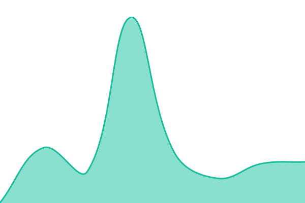
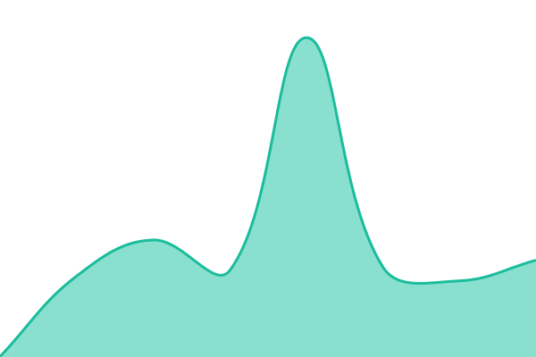
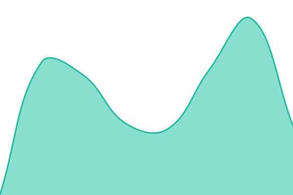
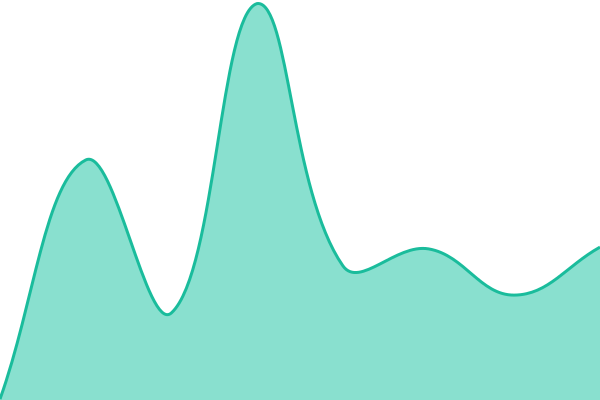
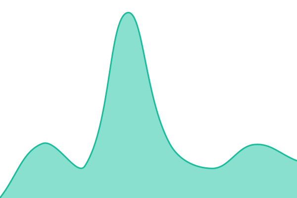

# [📈 Live Status](https://status.7thspectrum.net): <!--live status--> **🟧 Partial outage**

This repository contains the open-source uptime monitor and status page for [audioeptesicus](https://status.7thspectrum.net), powered by [Upptime](https://github.com/upptime/upptime).

With [Upptime](https://upptime.js.org), you can get your own unlimited and free uptime monitor and status page, powered entirely by a GitHub repository. We use [Issues](https://github.com/audioeptesicus/upptime/issues) as incident reports, [Actions](https://github.com/audioeptesicus/upptime/actions) as uptime monitors, and [Pages](https://status.7thspectrum.net) for the status page.

<!--start: status pages-->
<!-- This summary is generated by Upptime (https://github.com/upptime/upptime) -->
<!-- Do not edit this manually, your changes will be overwritten -->
<!-- prettier-ignore -->
| URL | Status | History | Response Time | Uptime |
| --- | ------ | ------- | ------------- | ------ |
|  [7thspectrum.net](https://7thspectrum.net) | 🟩 Up | [7thspectrum-net.yml](https://github.com/audioeptesicus/upptime/commits/HEAD/history/7thspectrum-net.yml) | 

 161ms
     
 | 

<a href="https://audioeptesicus.github.io/upptime/history/7thspectrum-net">100.00%</a>
    

|  [Cams](https://cams.7thspectrum.net) | 🟩 Up | [cams.yml](https://github.com/audioeptesicus/upptime/commits/HEAD/history/cams.yml) | 

 235ms
     
 | 

<a href="https://audioeptesicus.github.io/upptime/history/cams">100.00%</a>
    

|  [Plex](https://plex.7thspectrum.net) | 🟩 Up | [plex.yml](https://github.com/audioeptesicus/upptime/commits/HEAD/history/plex.yml) | 

 544ms
     
 | 

<a href="https://audioeptesicus.github.io/upptime/history/plex">100.00%</a>
    

|  [Plex Requests](https://request.7thspectrum.net) | 🟥 Down | [plex-requests.yml](https://github.com/audioeptesicus/upptime/commits/HEAD/history/plex-requests.yml) | 

 3219ms
     
 | 

<a href="https://audioeptesicus.github.io/upptime/history/plex-requests">0.01%</a>
    

|  [Nextcloud](https://drive.7thspectrum.net) | 🟩 Up | [nextcloud.yml](https://github.com/audioeptesicus/upptime/commits/HEAD/history/nextcloud.yml) | 

 453ms
     
 | 

<a href="https://audioeptesicus.github.io/upptime/history/nextcloud">100.00%</a>
    

|  [Pass](https://pass.7thspectrum.net) | 🟩 Up | [pass.yml](https://github.com/audioeptesicus/upptime/commits/HEAD/history/pass.yml) | 

 217ms
     
 | 

<a href="https://audioeptesicus.github.io/upptime/history/pass">100.00%</a>
    

|  [Home Assistant](https://ha.7thspectrum.net) | 🟩 Up | [home-assistant.yml](https://github.com/audioeptesicus/upptime/commits/HEAD/history/home-assistant.yml) | 

 163ms
     
 | 

<a href="https://audioeptesicus.github.io/upptime/history/home-assistant">100.00%</a>
    

|  [GitLab](https://git.7thspectrum.net) | 🟩 Up | [git-lab.yml](https://github.com/audioeptesicus/upptime/commits/HEAD/history/git-lab.yml) | 

 832ms
     
 | 

<a href="https://audioeptesicus.github.io/upptime/history/git-lab">100.00%</a>
    

|  [Cams - captcolour](https://cams.captcolour.com) | 🟩 Up | [cams-captcolour.yml](https://github.com/audioeptesicus/upptime/commits/HEAD/history/cams-captcolour.yml) | 

 379ms
     
 | 

<a href="https://audioeptesicus.github.io/upptime/history/cams-captcolour">100.00%</a>
    

|  [Cams - farmhouse](https://farmhouse.captcolour.com) | 🟥 Down | [cams-farmhouse.yml](https://github.com/audioeptesicus/upptime/commits/HEAD/history/cams-farmhouse.yml) | 

 0ms
     
 | 

<a href="https://audioeptesicus.github.io/upptime/history/cams-farmhouse">0.01%</a>
    

<!--end: status pages-->

[**Visit our status website →**](https://status.7thspectrum.net)

## 📄 License

- Powered by: [Upptime](https://github.com/upptime/upptime)
- Code: [MIT](./LICENSE) © [Anand Chowdhary](https://anandchowdhary.com)
- Data in the `./history` directory: [Open Database License](https://opendatacommons.org/licenses/odbl/1-0/)
